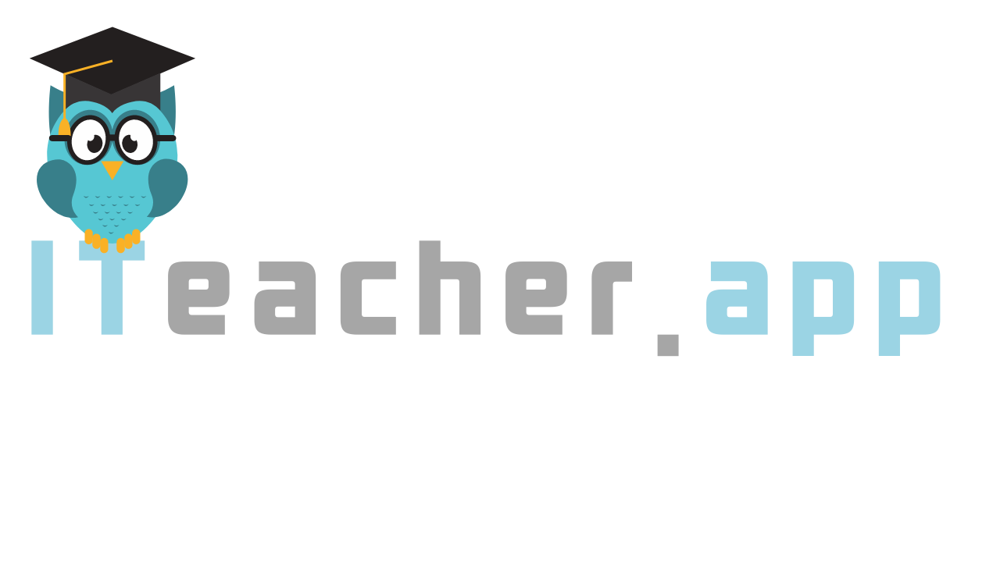

# **iTeacher - O Conhecimento inclui**

---

>Caso de estudo - Plataforma multilateral que conecta alunos e professores.

* Nossos Objetivos:

    * Primeiro objetivo

      Desenvolver uma plataforma multilateral que conecta alunos e professores.

    * Segundo objetivo

      Desenvolver um curso **gratuito** entender as funcionalidades assim como desenvolver novos recursos para a plataforma

* Nossa missão

    * Fomentar o empreendedorismo, em áreas de risco social (com a plataforma) e compartilhar conhecimento e tecnologia (curso) para pessoas em risco social que queiram empreender com tecnologia

---
> ### Instalação

* clonar o o repositório
    * git clone git@github.com:LuizPiresS/ITeacher.git
    * npm install

> ### Modelo de negócios

* [Modelo de negócios proposto](https://miro.com/app/board/o9J_kqWCpbw=/)

> ### Arquiteturas/designs utilizados

* Microsserviços

> ### Bibliotecas e ferramentas utilizadas

* [devcontainer](https://code.visualstudio.com/docs/remote/containers)
* [Husky](https://github.com/typicode/husky)
* [Lint-staged](https://github.com/okonet/lint-staged)
* [Github Actions](https://github.com/features/actions)
* [Docker](https://www.docker.com/)
* [NestJS](https://nestjs.com/)
* [Jest](https://jestjs.io/)

>### Features
